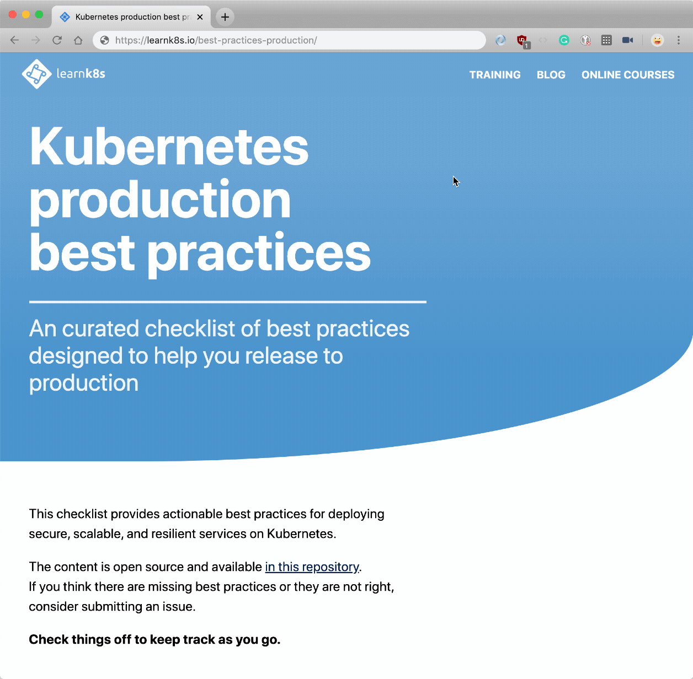

# Kubernetes production best-practices

This checklist provides actionable best practices for deploying secure, scalable, and resilient services on Kubernetes.

**Topics**

- [Application development](application-development.md)
- [Governance](governance.md)
- [Cluster configuration](configuration.md)
