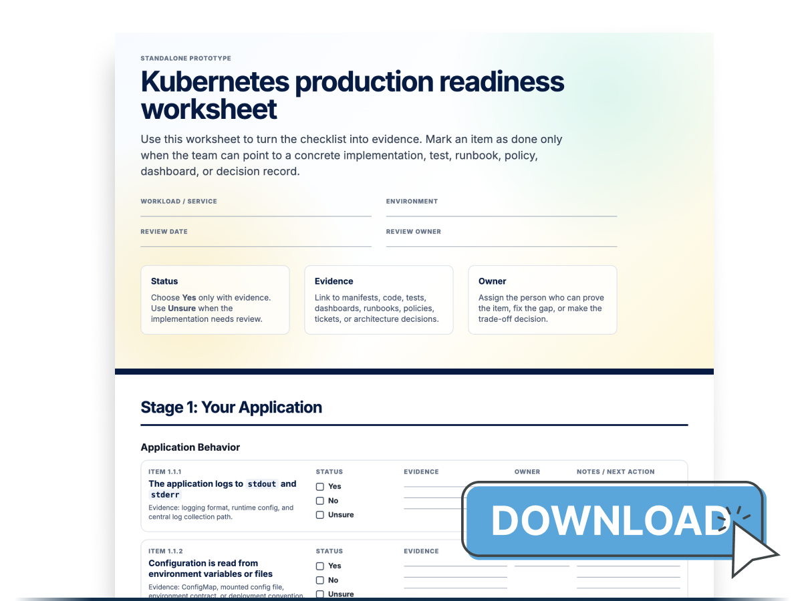
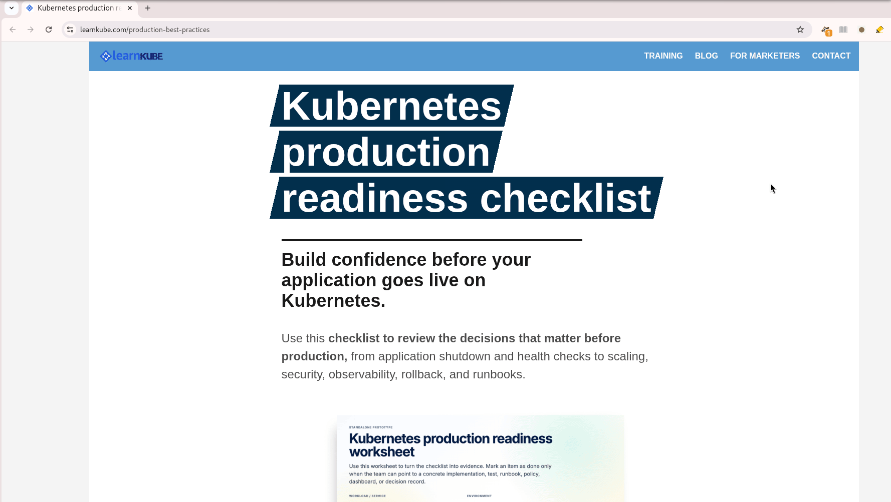

# Kubernetes production readiness checklist

This is a free, open checklist to help you deploy your applications to Kubernetes.

No form, email, or download is required. Use it in the browser, share it with your team, or adapt it for your own internal review.

**Topics**

- [Your application](01-your-application.md)
- [Your Kubernetes manifests](02-your-manifests.md)
- [Your security](03-your-security.md)
- [Scaling](04-scaling.md)
- [Going live](05-going-live.md)
